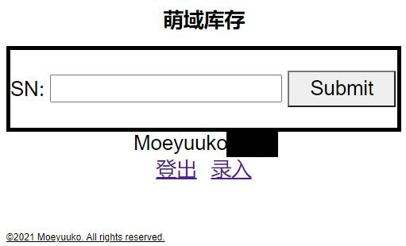
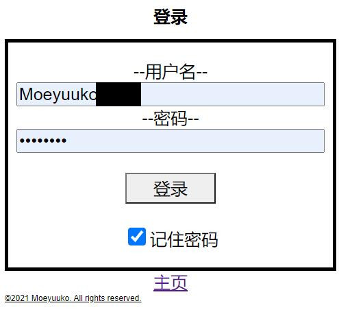
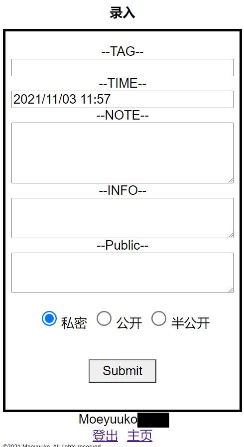
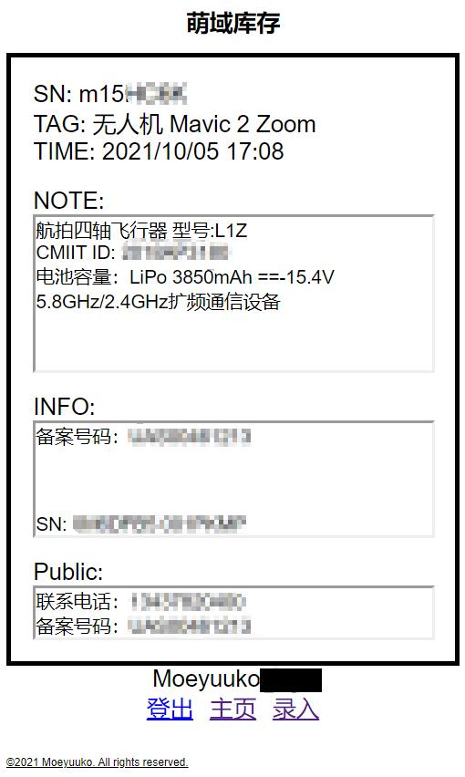

# 库存系统
基于: [FKUN](https://blog.fkun.tech/) 的 [数字化资产管理](https://blog.fkun.tech/archives/1504/)  
生成二维码 贴在设备上 一扫出信息  
  
## 使用
数据库导入表 sql/Inventory.sql 设置权限  
数据库连接权限 分只读和读写 填读写 一样也无所谓  
把 Config.new/.Config.php 配置文件复制到这个项目的根目录 然后填写好  
因为登录系统太简单了 压根不想写注册功能  
所以使用 Tools/Generate_password.php 生成加密后的密码填在数据库吧  

应该就能用了  2天写出来的 比较粗糙 还需要慢慢咕出来  
数据库的Error_login表是未来功能 用于拦截暴力破解  
## Demo_images

  
哈哈哈 起了个很二次元的名字